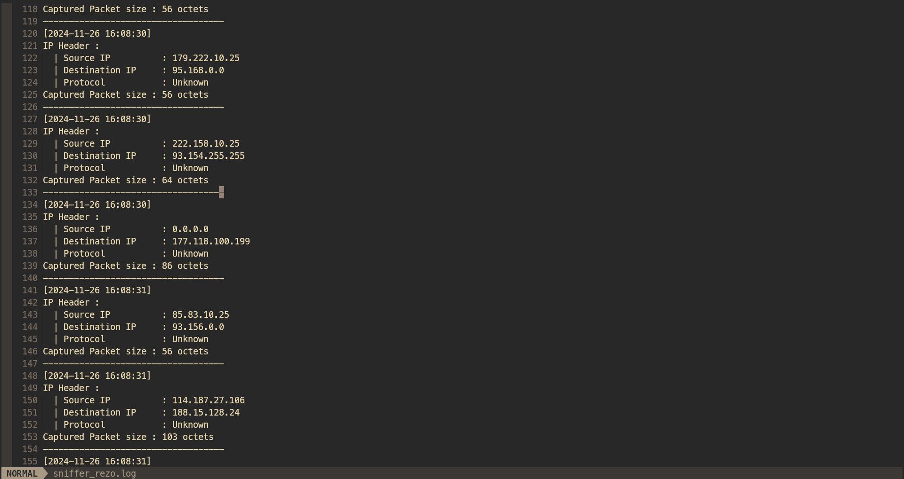

````md
# sniffer_rezo



`sniffer_rezo` is a lightweight C-based network packet sniffer designed to run as a background daemon on Linux systems. It captures and logs network traffic in real time, displaying detailed information about IP packets, ports, and protocols (TCP, UDP, ICMP).

> 🛠️ This project was created as a small exercise to learn how to use `fork()`, raw sockets, and how to daemonize a process in C.

---

## Features

- Runs as a background daemon
- Logs captured packets with timestamps
- Detects TCP, UDP, and ICMP protocols
- Handles system signals (SIGUSR1 for network info, SIGUSR2 and SIGTERM to stop)
- Outputs logs to `/var/log/sniffer_rezo.log`

---

## Build

```bash
make
````

## Run

```bash
sudo ./sniffer_rezo
```

## Dependencies

* GCC
* Root permissions (for raw socket usage)

